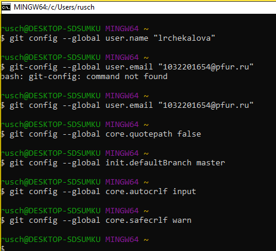
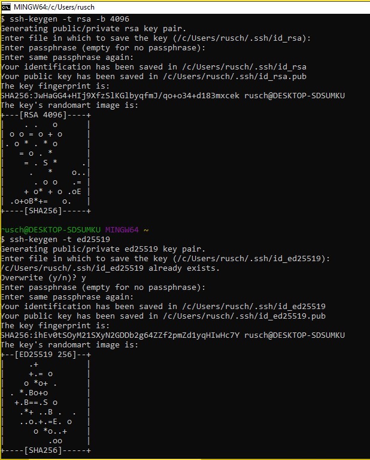
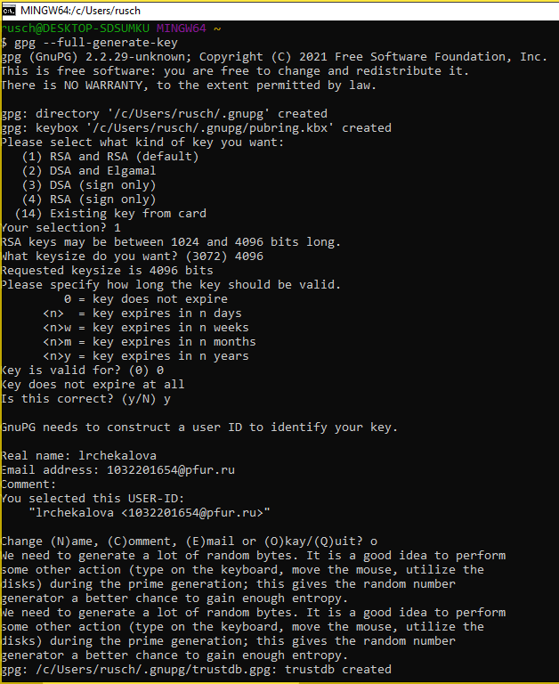
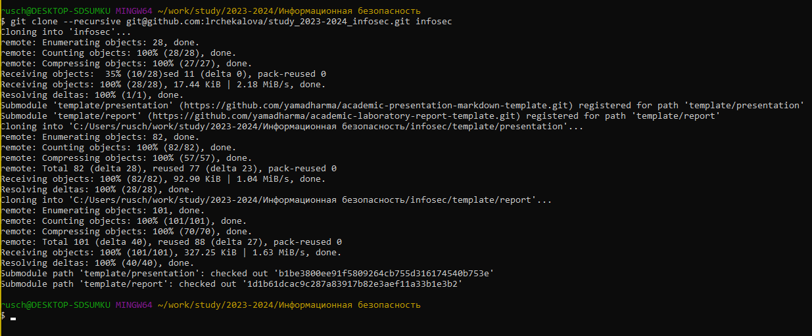
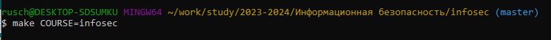
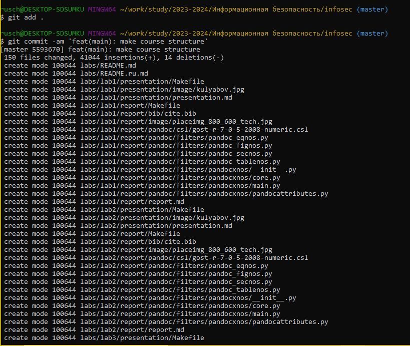
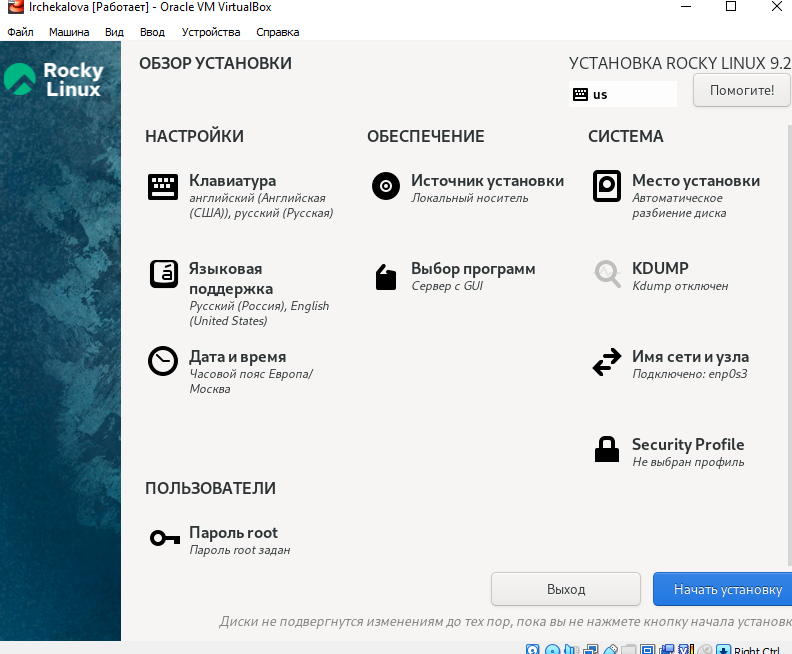
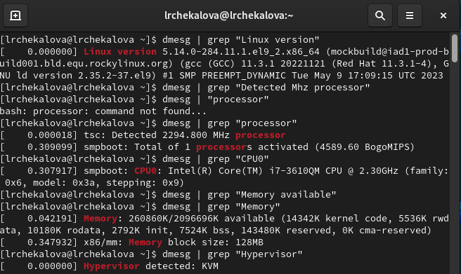
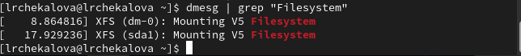

---
## Front matter
lang: ru-RU
title: Презентация по лабораторной работе №1
subtitle: Информационная безопасность
author:
  - Чекалова Л. Р.
institute:
  - Российский университет дружбы народов, Москва, Россия
date: 08 сентября 2023

## i18n babel
babel-lang: russian
babel-otherlangs: english

## Formatting pdf
toc: false
toc-title: Содержание
slide_level: 2
aspectratio: 169
section-titles: true
theme: metropolis
header-includes:
 - \metroset{progressbar=frametitle,sectionpage=progressbar,numbering=fraction}
 - '\makeatletter'
 - '\beamer@ignorenonframefalse'
 - '\makeatother'
---

# Информация

## Докладчик

:::::::::::::: {.columns align=center}
::: {.column width="70%"}

  * Чекалова Лилия Руслановна
  * студент 4 курса группы НФИбд-02-20
  * ст. б. 1032201654
  * Российский университет дружбы народов
  * [1032201654@pfur.ru](mailto:1032201654@@pfur.ru)

:::
::::::::::::::

# Вводная часть

## Актуальность

- Возможность совместной работы над одним проектом
- Легкость в отслеживании версий файлов
- Облегчение работы с другими операционными системами
- Необходимость быстро делать отчёты
- Простота форматирования текста

## Цели и задачи

- Настроить git
- Создать унифицированную структуру рабочего каталога на основе шаблона
- Установить операционную систему на виртуальную машину
- Найти информацию о системе

## Материалы и методы

- Веб-сервис `GitHub` для работы с репозиториями
- Программа для виртуализации ОС `VirtualBox`
- Процессор `pandoc` для входного формата Markdown
- Результирующие форматы
	- `pdf`
	- `docx`
- Автоматизация процесса создания: `Makefile`

# Ход работы

## Настройка git

{width=70%}

## Генерация ssh-ключей

## Генерация gpg-ключа

## Копирование и структурирование репозитория

{width=70%}

{width=70%}

## Загрузка репозитория на GitHub

{width=70%}

## Установка операционной системы

- Выбираем тип ОС
- Задаем объем оперативной памяти и жесткого диска
- Подключаем образ оптического диска
- Выбираем программы
- Настраиваем имя узла
- Задаем пароль для root

## Обзор установки

{width=70%}

## Поиск информации

{width=70%}

{width=70%}

# Результаты

## Результаты работы

- Приобретены умения установки и настройки операционной системы на виртуальную машину
- Закреплены навыки работы с системой Git и языком разметки Markdown
- Создан структурированный каталог для лабораторных работ