---
## Front matter
title: "Отчет по лабораторной работе №1"
subtitle: "Информационная безопасность"
author: "Чекалова Лилия Руслановна"

## Generic otions
lang: ru-RU
toc-title: "Содержание"

## Bibliography
bibliography: bib/cite.bib
csl: pandoc/csl/gost-r-7-0-5-2008-numeric.csl

## Pdf output format
toc: true # Table of contents
toc-depth: 2
lof: true # List of figures
lot: true # List of tables
fontsize: 12pt
linestretch: 1.5
papersize: a4
documentclass: scrreprt
## I18n polyglossia
polyglossia-lang:
  name: russian
  options:
	- spelling=modern
	- babelshorthands=true
polyglossia-otherlangs:
  name: english
## I18n babel
babel-lang: russian
babel-otherlangs: english
## Fonts
mainfont: Times New Roman
romanfont: Times New Roman
sansfont: DejaVu Sans
monofont: DejaVu Sans Mono
mainfontoptions: Ligatures=TeX
romanfontoptions: Ligatures=TeX
sansfontoptions: Ligatures=TeX,Scale=MatchLowercase
monofontoptions: Scale=MatchLowercase,Scale=0.9
## Biblatex
biblatex: true
biblio-style: "gost-numeric"
biblatexoptions:
  - parentracker=true
  - backend=biber
  - hyperref=auto
  - language=auto
  - autolang=other*
  - citestyle=gost-numeric
## Pandoc-crossref LaTeX customization
figureTitle: "Рис."
tableTitle: "Таблица"
listingTitle: "Листинг"
lofTitle: "Список иллюстраций"
lotTitle: "Список таблиц"
lolTitle: "Листинги"
## Misc options
indent: true
header-includes:
  - \usepackage{indentfirst}
  - \usepackage{float} # keep figures where there are in the text
  - \floatplacement{figure}{H} # keep figures where there are in the text
---

# Цель работы

- Приобретение практических навыков установки операционной системы на виртуальную машину
-Освоение умений по работе с git
- Составление унифицированной структуры рабочего каталога лабораторных работ

# Задание

- Генерация ssh- и gpg-ключей
- Создание репозитория по шаблону
- Установка операционной системы с указанными характеристиками на виртуальную машину
- Поиск информации о системе

# Теоретическое введение

Системы контроля версий (Version Control System, VCS) применяются при работе нескольких человек над одним проектом. Обычно основное дерево проекта хранится в локальном или удалённом репозитории, к которому настроен доступ для участников проекта.

При внесении изменений в содержание проекта система контроля версий позволяет их фиксировать, совмещать изменения, произведённые разными участниками проекта, производить откат к любой более ранней версии проекта, если это требуется.

Среди классических VCS наиболее известны CVS, Subversion, а среди распределённых -- Git, Bazaar, Mercurial. Принципы их работы схожи, отличаются они в основном синтаксисом используемых в работе команд.

Более подробно о см. в [@lab-vm;@lab-gh].

# Выполнение лабораторной работы

Для выполнения лабораторной работы сначала была произведена настройка параметров git, таких как имя и почта пользователя, установка кодирования и другие (рис. @fig:001).

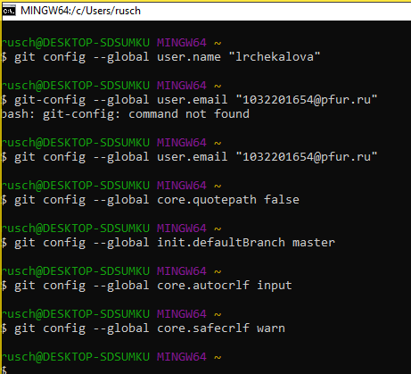{#fig:001 width=70%}

Далее были сгенерированы ssh-ключи по алгоритмам rsa и ed25519 (рис. @fig:002).

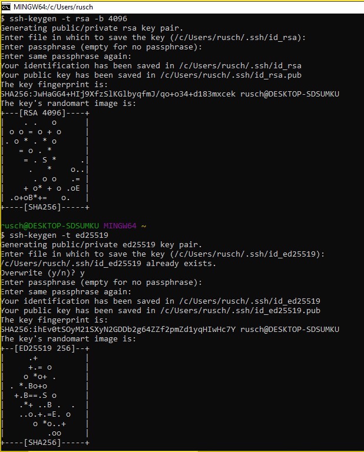{#fig:002 width=70%}

Также был сгенерирован gpg-ключ с указанными опциями (рис. @fig:003-@fig:004).

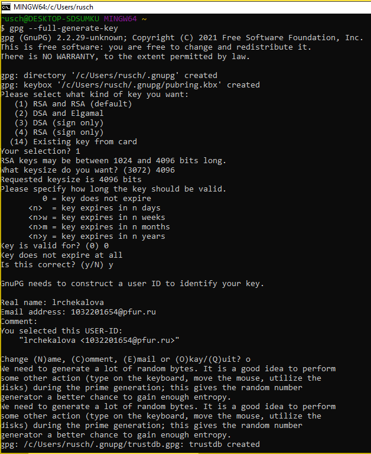{#fig:003 width=70%}

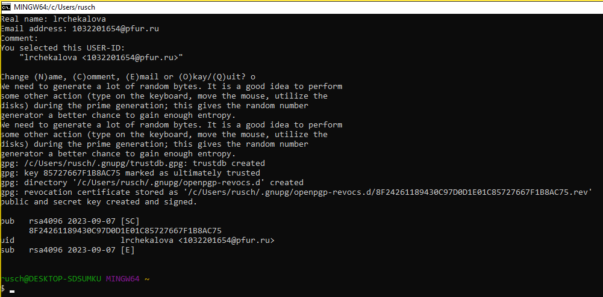{#fig:004 width=70%}

Содержимое ключа было скопировано (рис. @fig:005) и добавлено к аккаунту на сайте GitHub (рис. @fig:006).

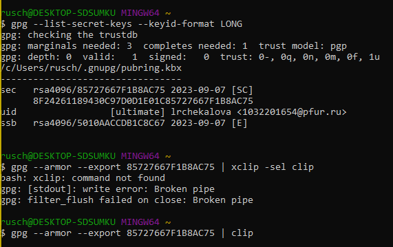{#fig:005 width=70%}

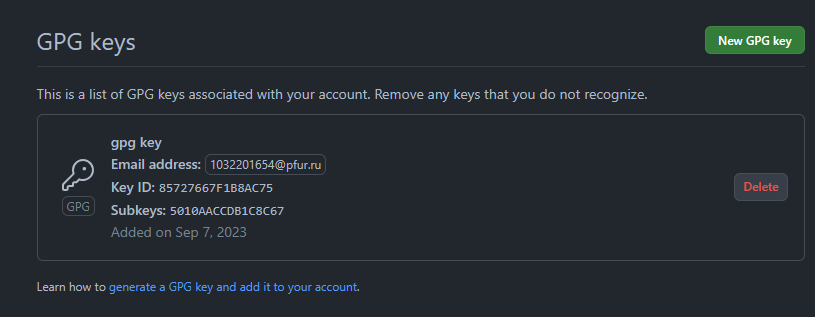{#fig:006 width=70%}

Далее был скопирован репозиторий с помощью команды git clone (рис. @fig:007) и с помощью команды make COURSE был построен рабочий каталог по шаблону (рис. @fig:008).

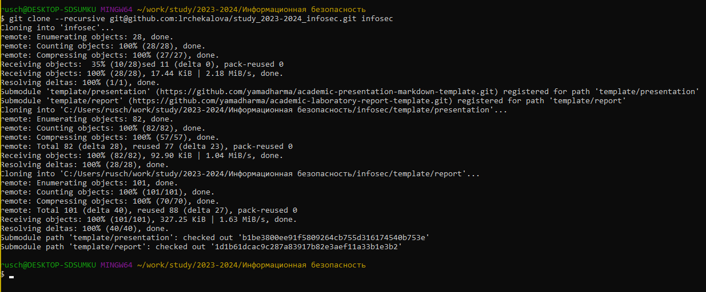{#fig:007 width=70%}

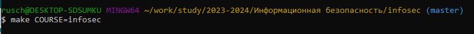{#fig:008 width=70%}

Изменения были отправлены на сервер (рис. @fig:009-@fig:010).

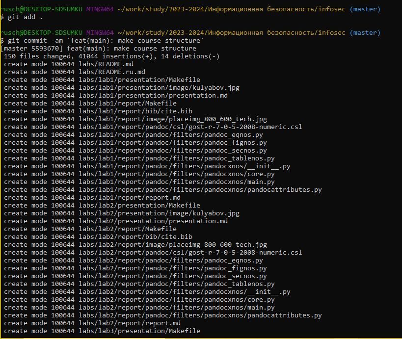{#fig:009 width=70%}

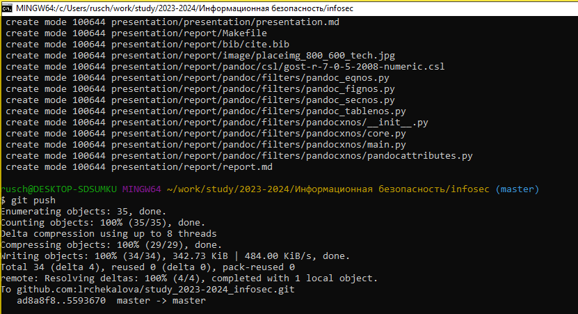{#fig:010 width=70%}

После этого я перешла к установке операционной системы на виртуальную машину. Сначала были заданы имя и тип операционной системы (рис. @fig:011).

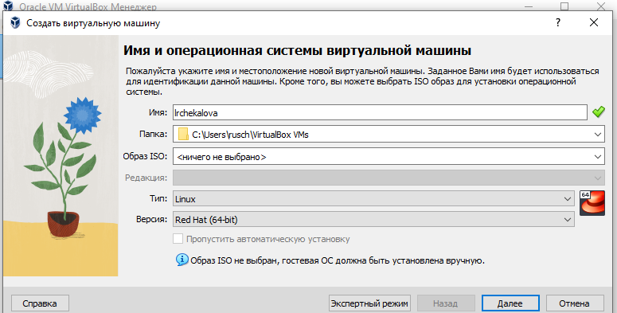{#fig:011 width=70%}

Были установлены объемы оперативной памяти (рис. @fig:012) и жесткого диска (рис. @fig:013).

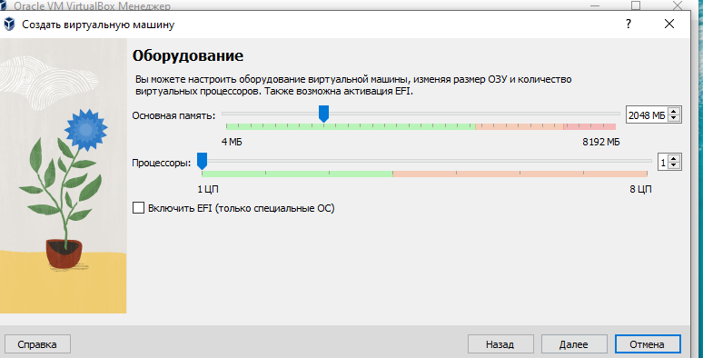{#fig:012 width=70%}

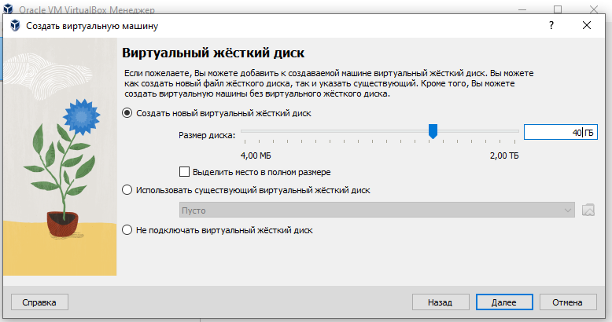{#fig:013 width=70%}

Был подключен образ оптического диска через окно "Носители" виртуальной машины (рис. @fig:014).

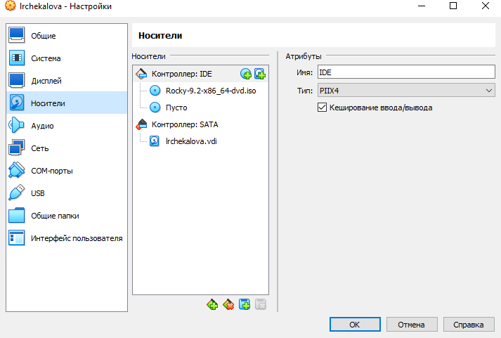{#fig:014 width=70%}

Указали в разделе выбора программ сервер с GUI и средства разработки (рис. @fig:015).

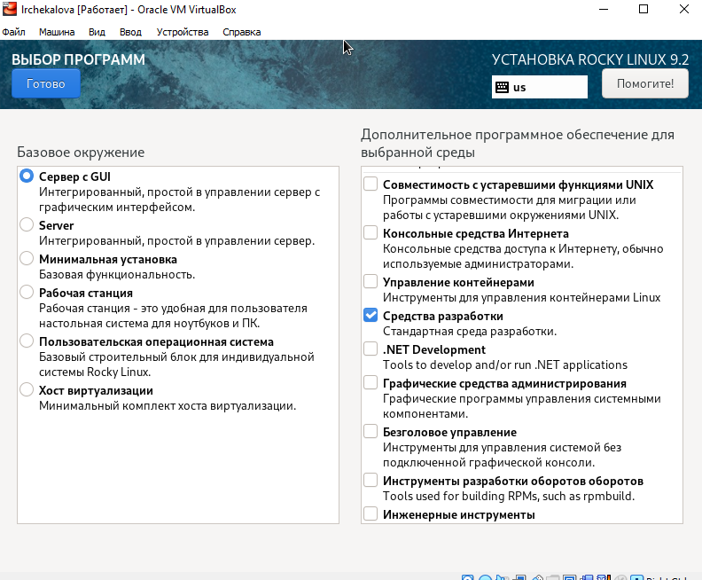{#fig:015 width=70%}

Включили сетевое соединение и настроили имя узла (рис. @fig:016).

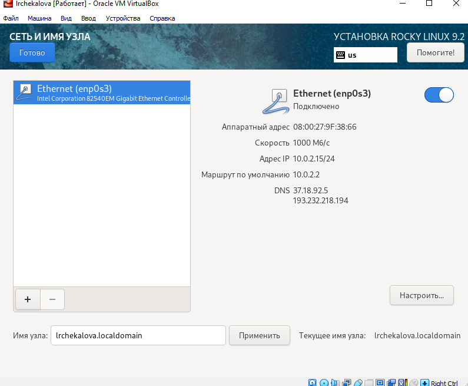{#fig:016 width=70%}

Задали пароль для root (рис. @fig:017).

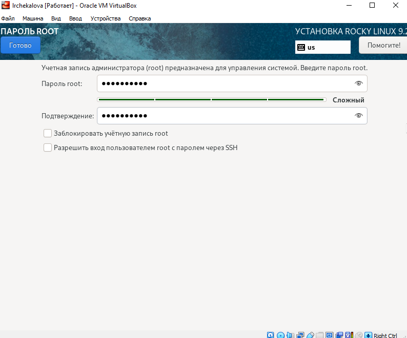{#fig:017 width=70%}

Отключили KDUMP. Окно обзора установки выглядит следующим образом (рис. @fig:018).

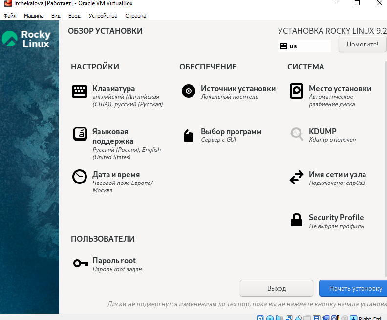{#fig:018 width=70%}

Перезагрузили систему, залогинились и подключили образ диска дополнений гостевой ОС (рис. @fig:019).

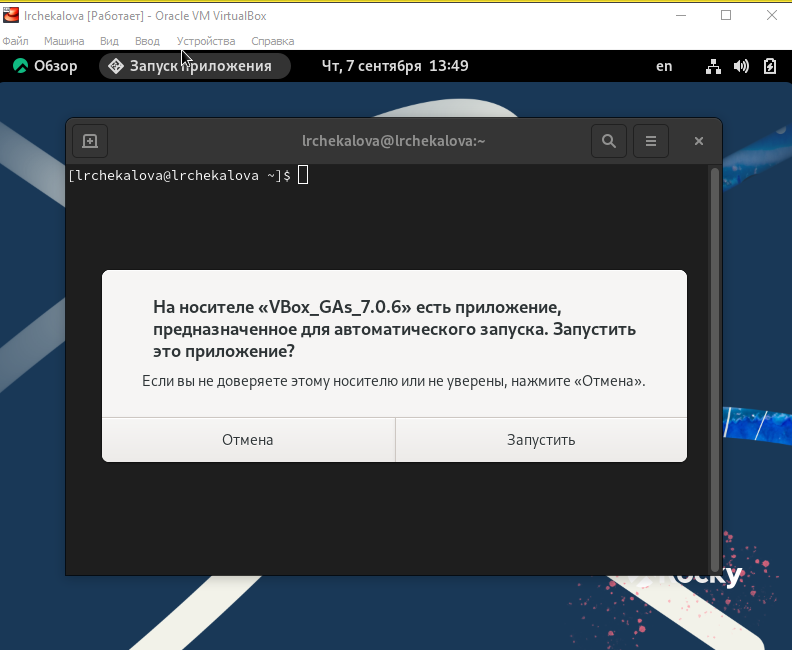{#fig:019 width=70%}

С помощью команды dmesg нашли информацию о системе, а именно о версии ядра Linux, частоте процессора, модели процессора, объеме доступной оперативной памяти, типе обнаруженного гипервизора (рис. @fig:020), типе файловой системы и последовательности монтирования файловых систем (рис. @fig:021).

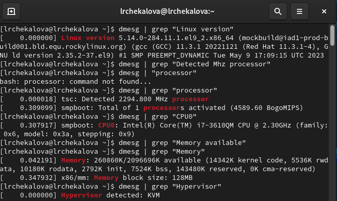{#fig:020 width=70%}

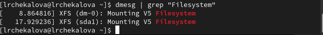{#fig:021 width=70%}

# Выводы

В результате лабораторной работы мной были получены знания об установке операционной системы на виртуальную машину, отточены навыки работы с системой Git, а также согласно установленному шаблону был создан рабочий каталог для лабораторных работ.

# Список литературы{.unnumbered}

::: {#refs}
:::
