---
## Front matter
title: "Отчет по лабораторной работе №2"
subtitle: "Информационная безопасность"
author: "Чекалова Лилия Руслановна"

## Generic otions
lang: ru-RU
toc-title: "Содержание"

## Bibliography
bibliography: bib/cite.bib
csl: pandoc/csl/gost-r-7-0-5-2008-numeric.csl

## Pdf output format
toc: true # Table of contents
toc-depth: 2
lof: true # List of figures
lot: true # List of tables
fontsize: 12pt
linestretch: 1.5
papersize: a4
documentclass: scrreprt
## I18n polyglossia
polyglossia-lang:
  name: russian
  options:
	- spelling=modern
	- babelshorthands=true
polyglossia-otherlangs:
  name: english
## I18n babel
babel-lang: russian
babel-otherlangs: english
## Fonts
mainfont: Times New Roman
romanfont: Times New Roman
sansfont: DejaVu Sans
monofont: DejaVu Sans Mono
mainfontoptions: Ligatures=TeX
romanfontoptions: Ligatures=TeX
sansfontoptions: Ligatures=TeX,Scale=MatchLowercase
monofontoptions: Scale=MatchLowercase,Scale=0.9
## Biblatex
biblatex: true
biblio-style: "gost-numeric"
biblatexoptions:
  - parentracker=true
  - backend=biber
  - hyperref=auto
  - language=auto
  - autolang=other*
  - citestyle=gost-numeric
## Pandoc-crossref LaTeX customization
figureTitle: "Рис."
tableTitle: "Таблица"
listingTitle: "Листинг"
lofTitle: "Список иллюстраций"
lotTitle: "Список таблиц"
lolTitle: "Листинги"
## Misc options
indent: true
header-includes:
  - \usepackage{indentfirst}
  - \usepackage{float} # keep figures where there are in the text
  - \floatplacement{figure}{H} # keep figures where there are in the text
---

# Цель работы

- Приобретение практических навыков работы в консоли с атрибутами файлов
- Закрепление теоретических основ дискреционного разграничения доступа в современных системах с открытым кодом на базе ОС Linux

# Задание

- Создание новой учетной записи
- Просмотр сведений об учетной записи
- Изменение прав доступа к директориям и файлам
- Проверка возможных в рамках заданных прав доступа действий
- Заполнение таблиц

# Теоретическое введение

Файлы и директории имеют три вида прав доступа:

- Чтение --- разрешает получать содержимое файла, но не изменять. Для каталога позволяет получить список файлов и каталогов, расположенных в нем;
- Запись --- разрешает записывать новые данные в файл или изменять существующие, а также позволяет создавать и изменять файлы и каталоги;
- Выполнение --- разрешает выполнять файл как программу и переходить в директорию.

Каждый файл имеет три категории пользователей, для которых можно устанавливать различные сочетания прав доступа:

- Владелец --- набор прав для владельца файла, пользователя, который его создал или сейчас установлен его владельцем. Обычно владелец имеет все права.
- Группа --- любая группа пользователей, существующая в системе и привязанная к файлу. Но это может быть только одна группа и обычно это группа владельца, хотя для файла можно назначить и другую группу.
Остальные --- пользователи, не входящие в предыдущие категории.

Каждый пользователь может получить полный доступ только к файлам, владельцем которых он является или к тем, доступ к которым ему разрешен. Только пользователь Root может работать со всеми файлами независимо от их набора их полномочий.

Более подробно о см. в [@lab-theory;@losst].

# Выполнение лабораторной работы

В качестве первого шага лабораторной работы мы перешли в режим sudo, дающий нам больше прав, и создали учетную запись guest с помощью команды useradd (рис. @fig:001).

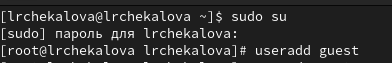{#fig:001 width=70%}

Далее мы задали пароль для этой учетной записи (рис. @fig:002).

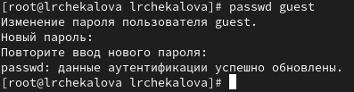{#fig:002 width=70%}

После этого мы вошли в систему от имени только что созданного пользователя (рис. @fig:003).

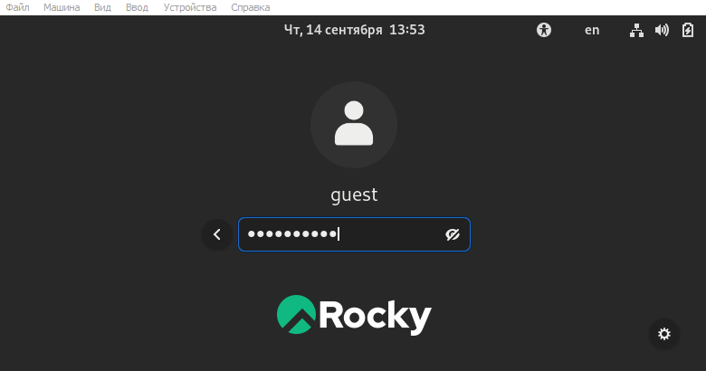{#fig:003 width=70%}

Мы определили директорию, в которой находимся, с помощью команды pwd, узнали информацию об имени пользователя командой whoami, уточнили с помощью команды id информацию об имени и группах пользователя и сравнили вывод с выводом команды groups (рис. @fig:004). Результаты команд не противоречат друг другу.

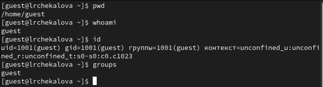{#fig:004 width=70%}

Просмотрели содержимое etc/passwd и нашли информацию о нашем пользователе командой grep (рис. @fig:005). Данные соответствуют полученным ранее.

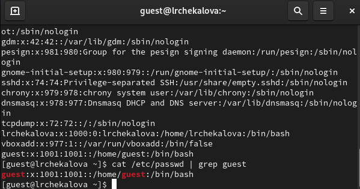{#fig:005 width=70%}

Определили список существующих директорий с помощью команды ls -l и попытались получить информацию о расширенных атрибутах поддиректорий /home с помощью команды lsattr (рис. @fig:006). Доступ к поддиректории, относящейся к другой учетной записи, получить не удалось.

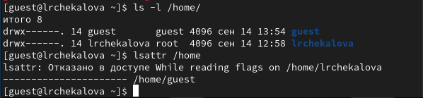{#fig:006 width=70%}

Далее создали папку dir1 и посмотрели права доступа (рис. @fig:007) и расширенные атрибуты (рис. @fig:008), установленные на эту папку.

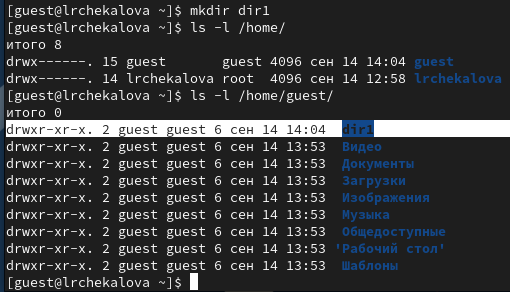{#fig:007 width=70%}

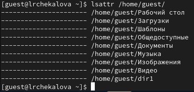{#fig:008 width=70%}

Сняли с директории все атрибуты командой chmod (рис. @fig:009).

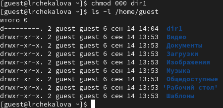{#fig:009 width=70%}

Попытались создать в этой директории файл, но нам было отказано в доступе (рис. @fig:010).

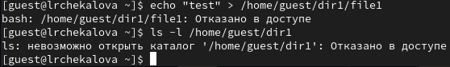{#fig:010 width=70%}

Комбинируя разные права доступа к директории и к файлу, проверили, какие действия доступны для разных прав доступа (рис. @fig:011-@fig:012).

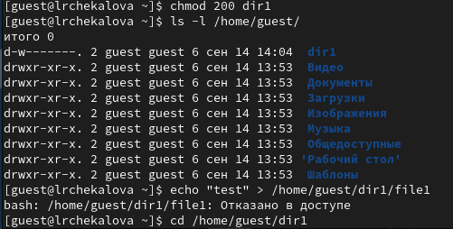{#fig:011 width=70%}

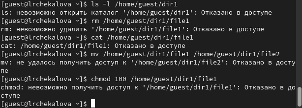{#fig:012 width=70%}

Заполнили таблицу полученной информацией (рис. @fig:013, @fig:014, @fig:015).

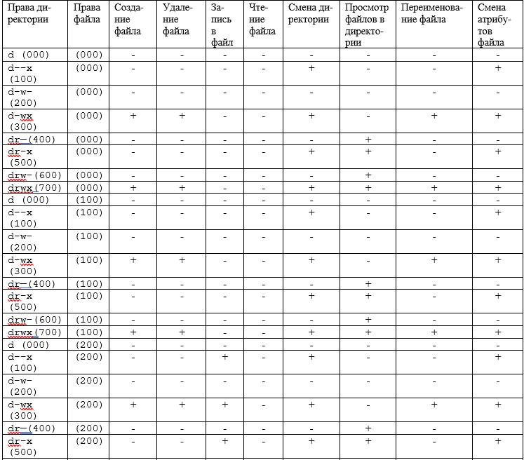{#fig:013 width=70%}

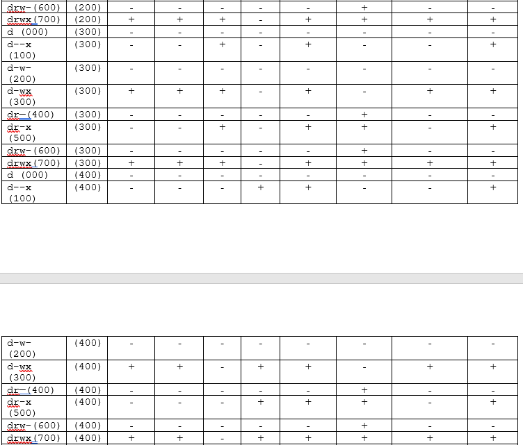{#fig:014 width=70%}

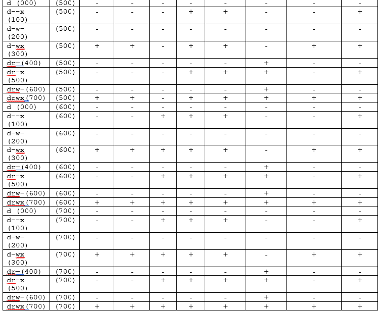{#fig:015 width=70%}

Проанализировали полученную таблицу и определили, какие минимальные права доступа на директорию и на файл необходимы для различных операций (рис. @fig:016). Мы видим, что, например, создание, переименование и удаление файла не требует от файла прав доступа на чтение, запись или исполнение.

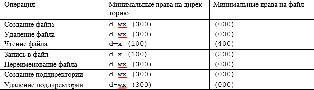{#fig:016 width=70%}

# Выводы

В результате лабораторной работы мной были получены навыки работы с атрибутами файлов, закреплены знания о правах доступа в системах на базе ОС Linux, а также были выявлены минимальные необходимые права доступа для выполнения операций над файлами и директориями.

# Список литературы{.unnumbered}

::: {#refs}
:::
