---
## Front matter
title: "Отчет по лабораторной работе №3"
subtitle: "Информационная безопасность"
author: "Чекалова Лилия Руслановна"

## Generic otions
lang: ru-RU
toc-title: "Содержание"

## Bibliography
bibliography: bib/cite.bib
csl: pandoc/csl/gost-r-7-0-5-2008-numeric.csl

## Pdf output format
toc: true # Table of contents
toc-depth: 2
lof: true # List of figures
lot: true # List of tables
fontsize: 12pt
linestretch: 1.5
papersize: a4
documentclass: scrreprt
## I18n polyglossia
polyglossia-lang:
  name: russian
  options:
	- spelling=modern
	- babelshorthands=true
polyglossia-otherlangs:
  name: english
## I18n babel
babel-lang: russian
babel-otherlangs: english
## Fonts
mainfont: Times New Roman
romanfont: Times New Roman
sansfont: DejaVu Sans
monofont: DejaVu Sans Mono
mainfontoptions: Ligatures=TeX
romanfontoptions: Ligatures=TeX
sansfontoptions: Ligatures=TeX,Scale=MatchLowercase
monofontoptions: Scale=MatchLowercase,Scale=0.9
## Biblatex
biblatex: true
biblio-style: "gost-numeric"
biblatexoptions:
  - parentracker=true
  - backend=biber
  - hyperref=auto
  - language=auto
  - autolang=other*
  - citestyle=gost-numeric
## Pandoc-crossref LaTeX customization
figureTitle: "Рис."
tableTitle: "Таблица"
listingTitle: "Листинг"
lofTitle: "Список иллюстраций"
lotTitle: "Список таблиц"
lolTitle: "Листинги"
## Misc options
indent: true
header-includes:
  - \usepackage{indentfirst}
  - \usepackage{float} # keep figures where there are in the text
  - \floatplacement{figure}{H} # keep figures where there are in the text
---

# Цель работы

- Приобретение практических навыков работы в консоли с атрибутами файлов для групп пользователей

# Задание

- Создание двух учетных записей
- Объединение пользователей в одну группу
- Изменение прав доступа одним пользователем и проверка возможных в рамках заданных прав доступа действий другим пользователем
- Заполнение таблиц

# Теоретическое введение

Файлы и директории имеют три вида прав доступа:

- Чтение --- разрешает получать содержимое файла, но не изменять. Для каталога позволяет получить список файлов и каталогов, расположенных в нем;
- Запись --- разрешает записывать новые данные в файл или изменять существующие, а также позволяет создавать и изменять файлы и каталоги;
- Выполнение --- разрешает выполнять файл как программу и переходить в директорию.

Каждый файл имеет три категории пользователей, для которых можно устанавливать различные сочетания прав доступа:

- Владелец --- набор прав для владельца файла, пользователя, который его создал или сейчас установлен его владельцем. Обычно владелец имеет все права.
- Группа --- любая группа пользователей, существующая в системе и привязанная к файлу. Но это может быть только одна группа и обычно это группа владельца, хотя для файла можно назначить и другую группу.
Остальные --- пользователи, не входящие в предыдущие категории.

Каждый пользователь может получить полный доступ только к файлам, владельцем которых он является или к тем, доступ к которым ему разрешен. В данной лабораторной работе будет рассматриваться доступ к файлам через общую группу.

Более подробно о см. в [@lab-theory;@losst].

# Выполнение лабораторной работы

В качестве первого шага лабораторной работы мы перешли в режим sudo, дающий нам больше прав, создали учетные записи guest и guest2 с помощью команды useradd и добавили пользователя guest2 в группу guest (рис. @fig:001).

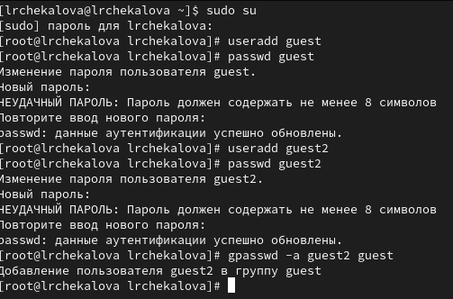{#fig:001 width=70%}

Далее мы осуществили вход в систему от двух пользователей на разных терминалах, определили, в какой директории мы находимся, командой pwd и получили информацию о группах, в которые входит каждый пользователь, с помощью команд id и groups (рис. @fig:002).

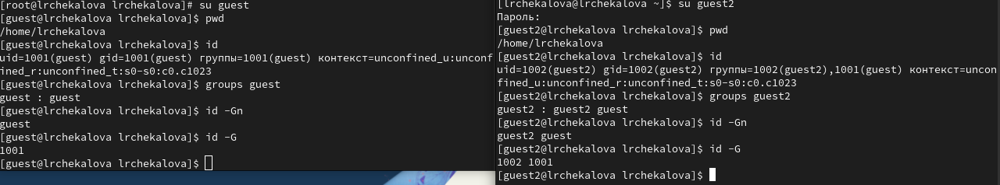{#fig:002 width=70%}

Посмотрели содержимое файла etc/group и увидели, что данные о группах пользователей совпадают с полученными ранее (рис. @fig:003).

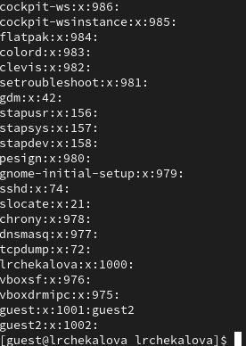{#fig:003 width=70%}

Зарегистрировали второго пользователя в группе guest командой newgrp (рис. @fig:004).

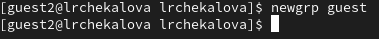{#fig:004 width=70%}

Дали всем пользователям группы все права доступа к директории /home/guest (рис. @fig:005).

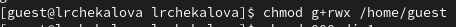{#fig:005 width=70%}

Создали папку dir1 и сняли с нее все атрибуты командой chmod 000. Проверили успешность действий командой ls -l (рис. @fig:006).

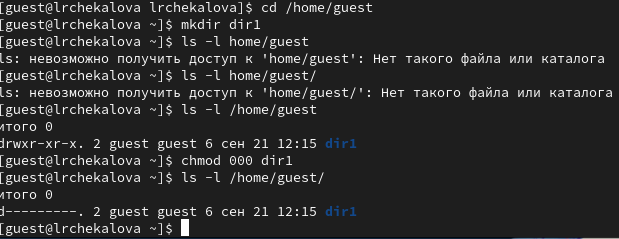{#fig:006 width=70%}

Сняли с ранее созданного файла file1 все атрибуты (рис. @fig:007).

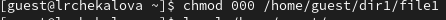{#fig:007 width=70%}

Комбинируя разные права доступа к директории и к файлу от имени guest, проверили, какие действия доступны для разных прав доступа от имени guest2 (рис. @fig:008).

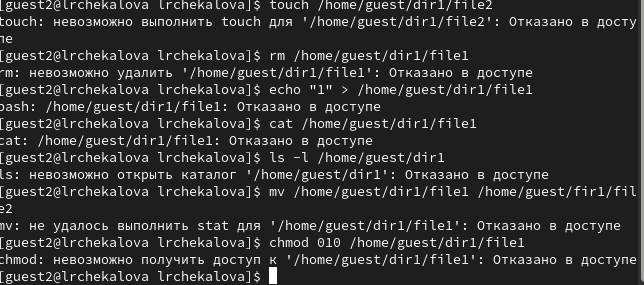{#fig:008 width=70%}

Заполнили таблицу полученной информацией (рис. @fig:009, @fig:010, @fig:011).

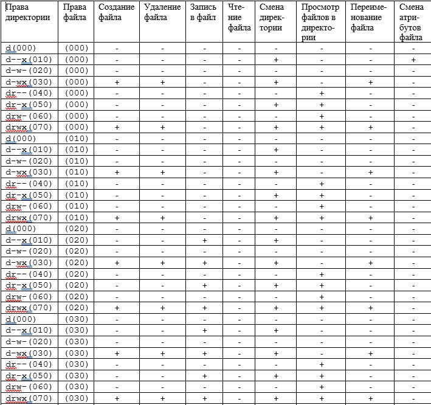{#fig:009 width=70%}

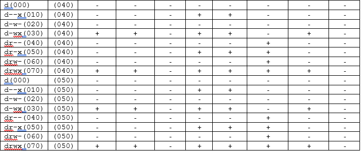{#fig:010 width=70%}

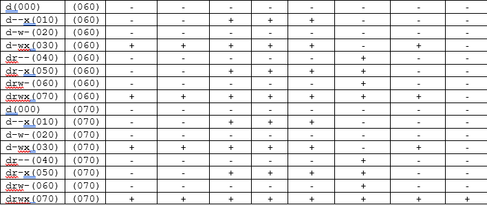{#fig:011 width=70%}

Проанализировали полученную таблицу и определили, какие минимальные права доступа на директорию и на файл необходимы для различных операций (рис. @fig:012). Мы видим, что, например, создание, переименование и удаление файла не требует от файла прав доступа на чтение, запись или исполнение. У нас получилась таблица, аналогичная таблице, полученной при выполнении предыдущей лабораторной работы.

{#fig:012 width=70%}

# Выводы

В результате лабораторной работы мной были получены навыки работы с атрибутами файлов, закреплены знания о правах доступа в системах на базе ОС Linux, а также были выявлены минимальные необходимые права доступа для выполнения операций над файлами и директориями. Также было замечено, что в большинстве случаев действия, доступные пользователям группы при определенных атрибутах, аналогичны действиям пользователя-владельца при тех же атрибутах.

# Список литературы{.unnumbered}

::: {#refs}
:::