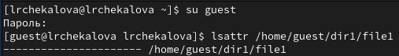
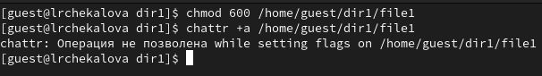
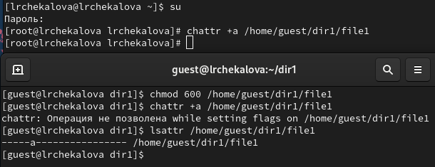
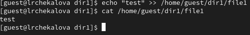
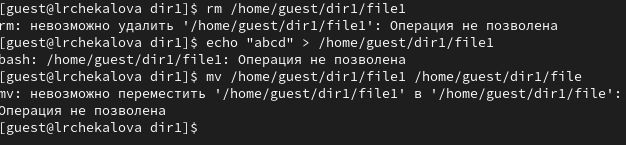
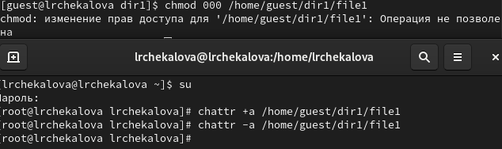
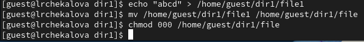
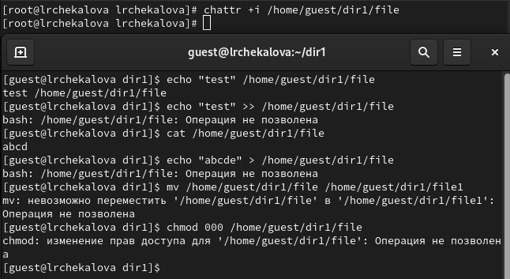
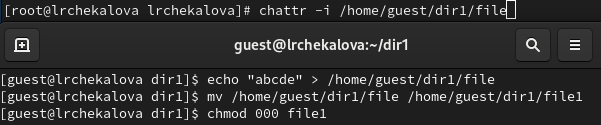

---
## Front matter
title: "Отчет по лабораторной работе №4"
subtitle: "Информационная безопасность"
author: "Чекалова Лилия Руслановна"

## Generic otions
lang: ru-RU
toc-title: "Содержание"

## Bibliography
bibliography: bib/cite.bib
csl: pandoc/csl/gost-r-7-0-5-2008-numeric.csl

## Pdf output format
toc: true # Table of contents
toc-depth: 2
lof: true # List of figures
lot: true # List of tables
fontsize: 12pt
linestretch: 1.5
papersize: a4
documentclass: scrreprt
## I18n polyglossia
polyglossia-lang:
  name: russian
  options:
	- spelling=modern
	- babelshorthands=true
polyglossia-otherlangs:
  name: english
## I18n babel
babel-lang: russian
babel-otherlangs: english
## Fonts
mainfont: Times New Roman
romanfont: Times New Roman
sansfont: DejaVu Sans
monofont: DejaVu Sans Mono
mainfontoptions: Ligatures=TeX
romanfontoptions: Ligatures=TeX
sansfontoptions: Ligatures=TeX,Scale=MatchLowercase
monofontoptions: Scale=MatchLowercase,Scale=0.9
## Biblatex
biblatex: true
biblio-style: "gost-numeric"
biblatexoptions:
  - parentracker=true
  - backend=biber
  - hyperref=auto
  - language=auto
  - autolang=other*
  - citestyle=gost-numeric
## Pandoc-crossref LaTeX customization
figureTitle: "Рис."
tableTitle: "Таблица"
listingTitle: "Листинг"
lofTitle: "Список иллюстраций"
lotTitle: "Список таблиц"
lolTitle: "Листинги"
## Misc options
indent: true
header-includes:
  - \usepackage{indentfirst}
  - \usepackage{float} # keep figures where there are in the text
  - \floatplacement{figure}{H} # keep figures where there are in the text
---

# Цель работы

- Приобретение практических навыков работы в консоли с расширенными атрибутами файлов.

# Задание

- Установка расширенных атрибутов на файл
- Проверка доступных действий
- Снятие расширенных атрибутов

# Теоретическое введение

Существует несколько видов расширенных атрибутов:

- a: файл с установленным атрибутом «a» можно открыть только в режиме добавления для записи. Только суперпользователь или процесс, обладающий возможностью CAP_LINUX_IMMUTABLE, может установить или очистить этот атрибут.
- i: Файл с атрибутом «i» не может быть изменён: его нельзя удалить или переименовать, нельзя создать ссылку на этот файл, большую часть метаданных файла нельзя изменить, и файл нельзя открыть в режиме записи. Только суперпользователь или процесс, обладающий возможностью CAP_LINUX_IMMUTABLE, может установить или очистить этот атрибут.
- c: файл с установленным атрибутом «c» автоматически сжимается на диске ядром. При чтении из этого файла возвращаются несжатые данные. Запись в этот файл сжимает данные перед их сохранением на диске.
- и другие.

Более подробно о см. в [@lab-theory;@zalinux].

# Выполнение лабораторной работы

В качестве первого шага лабораторной работы мы осуществили вход от лица пользователя guest и проверили расширенные атрибуты файла file1 с помощью команды lsattr (рис. @fig:001).

{#fig:001 width=70%}

Далее мы с помощью команды chmod установили права на запись и чтение для владельца файла и попробовали поменять расширенные атрибуты файла командой chattr (рис. @fig:002). Нам было отказано в изменении атрибута.

{#fig:002 width=70%}

Установили файлу атрибут «a» от имени суперпользователя и проверили успешность изменения атрибутов с помощью lsattr (рис. @fig:003).

{#fig:003 width=70%}

Выполнили дозапись в файл командой echo и проверили содержимое файла командой cat (рис. @fig:004).

{#fig:004 width=70%}

Попробовали удалить файл, заменить находящуюся в нем информацию, поменять права и переименовать файл (рис. @fig:005). Ни одна из операций не была успешной.

{#fig:005 width=70%}

Сняли атрибут «a» от лица суперпользователя (рис. @fig:006).

{#fig:006 width=70%}

Повторили указанные ранее действия (рис. @fig:007). На этот раз они выполнились успешно.

{#fig:007 width=70%}

Заменили атрибут «a» на атрибут «i» и повторили операции над файлом (рис. @fig:008). Ни одна из операций, включая дозапись в файл, не была выполнена.

{#fig:008 width=70%}

Сняли с файла атрибут «i» и повторили действия (рис. @fig:009). Все операции были завершены успешно.

{#fig:009 width=70%}

# Выводы

В результате лабораторной работы я повысила навыки использования командой строки и узнала, как используются расширенные атрибуты при разграничении доступа. Также я имела возможность связать теорию дискреционного разделения доступа с её реализацией в ОС Linux и опробовала действие на практике расширенных атрибутов «а» и «i».

# Список литературы{.unnumbered}

::: {#refs}
:::