---
## Front matter
lang: ru-RU
title: Презентация по лабораторной работе №5
subtitle: Информационная безопасность
author:
  - Чекалова Л. Р.
institute:
  - Российский университет дружбы народов, Москва, Россия
date: 5 октября 2023

## i18n babel
babel-lang: russian
babel-otherlangs: english

## Formatting pdf
toc: false
toc-title: Содержание
slide_level: 2
aspectratio: 169
section-titles: true
theme: metropolis
header-includes:
 - \metroset{progressbar=frametitle,sectionpage=progressbar,numbering=fraction}
 - '\makeatletter'
 - '\beamer@ignorenonframefalse'
 - '\makeatother'
---

# Информация

## Докладчик

:::::::::::::: {.columns align=center}
::: {.column width="70%"}

  * Чекалова Лилия Руслановна
  * студент 4 курса группы НФИбд-02-20
  * ст. б. 1032201654
  * Российский университет дружбы народов
  * [1032201654@pfur.ru](mailto:1032201654@@pfur.ru)

:::
::::::::::::::

# Вводная часть

## Актуальность

- Обеспечение безопасности

## Цели и задачи

- Приобретение практических навыков работы в консоли с дополнительными атрибутами файлов
- Изучение механизмов смены идентификатора процессов пользователей
- Изучение SetUID-, SetGID- и Sticky-битов

## Материалы и методы

- Веб-сервис `GitHub` для работы с репозиториями
- Программа для виртуализации ОС `VirtualBox`
- Процессор `pandoc` для входного формата Markdown
- Результирующие форматы
	- `pdf`
	- `docx`
- Автоматизация процесса создания: `Makefile`

# Ход работы

## Написание программы 1

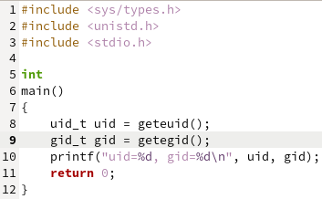{width=70%}

## Запуск программы 1

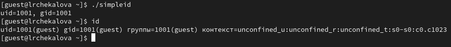

## Модификация программы

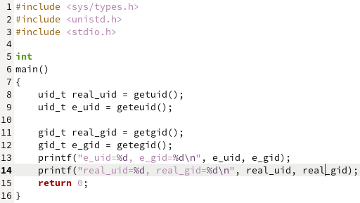{width=70%}

## Запуск модифицированной программы

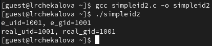{width=70%}

## Изменение владельца файла

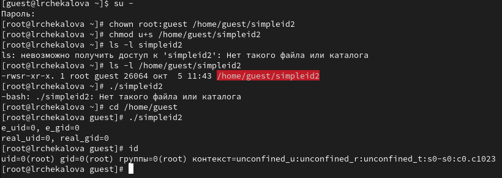{width=70%}

## Написание программы 3

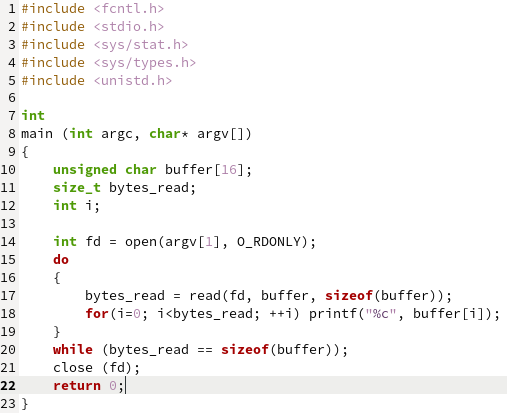{width=70%}

## Изменение прав доступа

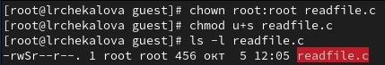{width=70%}

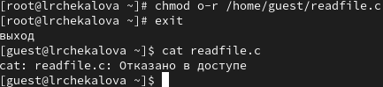{width=70%}

## Проверка наличия Sticky-бита

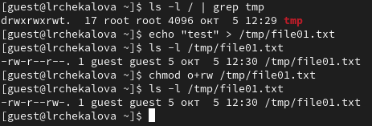{width=70%}

## Попытка чтения, изменения и удаления файла

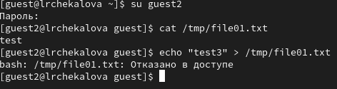{width=70%}

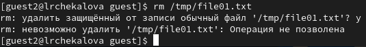{width=70%}

## Снятие Sticky-бита

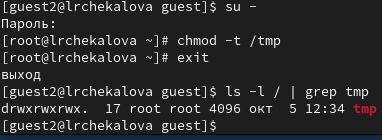{width=70%}

## Повторная попытка чтения, записи и удаления файла

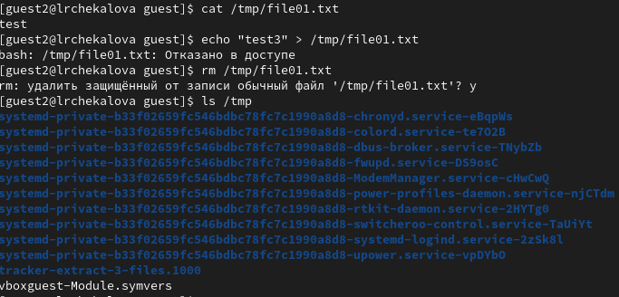{width=70%}

# Результаты

## Результаты работы

- Получены навыки работы с дополнительными атрибутами файлов
- Отточены навыки работы с механизмами смены владельца
- Рассмотрены принципы работы SetUID-, SetGID- и Sticky-битов