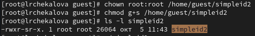

---
## Front matter
title: "Отчет по лабораторной работе №5"
subtitle: "Информационная безопасность"
author: "Чекалова Лилия Руслановна"

## Generic otions
lang: ru-RU
toc-title: "Содержание"

## Bibliography
bibliography: bib/cite.bib
csl: pandoc/csl/gost-r-7-0-5-2008-numeric.csl

## Pdf output format
toc: true # Table of contents
toc-depth: 2
lof: true # List of figures
lot: true # List of tables
fontsize: 12pt
linestretch: 1.5
papersize: a4
documentclass: scrreprt
## I18n polyglossia
polyglossia-lang:
  name: russian
  options:
	- spelling=modern
	- babelshorthands=true
polyglossia-otherlangs:
  name: english
## I18n babel
babel-lang: russian
babel-otherlangs: english
## Fonts
mainfont: Times New Roman
romanfont: Times New Roman
sansfont: DejaVu Sans
monofont: DejaVu Sans Mono
mainfontoptions: Ligatures=TeX
romanfontoptions: Ligatures=TeX
sansfontoptions: Ligatures=TeX,Scale=MatchLowercase
monofontoptions: Scale=MatchLowercase,Scale=0.9
## Biblatex
biblatex: true
biblio-style: "gost-numeric"
biblatexoptions:
  - parentracker=true
  - backend=biber
  - hyperref=auto
  - language=auto
  - autolang=other*
  - citestyle=gost-numeric
## Pandoc-crossref LaTeX customization
figureTitle: "Рис."
tableTitle: "Таблица"
listingTitle: "Листинг"
lofTitle: "Список иллюстраций"
lotTitle: "Список таблиц"
lolTitle: "Листинги"
## Misc options
indent: true
header-includes:
  - \usepackage{indentfirst}
  - \usepackage{float} # keep figures where there are in the text
  - \floatplacement{figure}{H} # keep figures where there are in the text
---

# Цель работы

- Изучение механизмов изменения идентификаторов, применения SetUID- и Sticky-битов
- Получение практических навыков работы в консоли с дополнительными атрибутами
- Рассмотрение работы механизма смены идентификатора процессов пользователей, а также влияние бита Sticky на запись и удаление файлов.

# Задание

- Написание программ
- Изменение владельца файлов и прав доступа на файлы
- Установка и снятие Sticky-бита и проверка доступных действий

# Теоретическое введение

Setuid –-- это бит разрешения, который позволяет пользователю запускать исполняемый файл с правами владельца этого файла. Другими словами, использование этого бита позволяет нам поднять привилегии пользователя в случае, если это необходимо. Классический пример использования этого бита в операционной системе это команда sudo.

На месте, где обычно установлен классический бит x (на исполнение), выставлен специальный бит s. Это позволяет обычному пользователю системы выполнять команды с повышенными привилегиями без необходимости входа в систему как root, зная пароль пользователя root.

Принцип работы Setgid очень похож на setuid с отличием, что файл будет запускаться пользователем от имени группы, которая владеет файлом.

Последний специальный бит разрешения – это Sticky Bit . В случае, если этот бит установлен для папки, то файлы в этой папке могут быть удалены только их владельцем. Пример использования этого бита в операционной системе это системная папка /tmp . Эта папка разрешена на запись любому пользователю, но удалять файлы в ней могут только пользователи, являющиеся владельцами этих файлов.

Более подробно о см. в [@lab-theory;@ruvds].

# Выполнение лабораторной работы

В качестве первого шага лабораторной работы мы осуществили вход от лица пользователя guest и создали файл simpleid.c (рис. @fig:001).

{#fig:001 width=70%}

Далее мы написали программу, которая выводитинформацию об идентификаторах пользователя и группы (рис. @fig:002). Скомпилировали эту программу (рис. @fig:003).

{#fig:002 width=70%}

{#fig:003 width=70%}

Выполнили эту программу и сравнили ее вывод с результатом работы системной команды id (рис. @fig:004). Результаты сходятся, но команда id дает дополнительные сведения, например, название группы.

{#fig:004 width=70%}

Модифицировали программу, чтобы она выводила также действительные идентификаторы (рис. @fig:005).

{#fig:005 width=70%}

Скомпилировали и запустили модифицированную программу (рис. @fig:006).

{#fig:006 width=70%}

Передали право владения программой суперпользователю и наделили его правом на исполнение программы. Запустили программу и сверили результат с выводом команды id (рис. @fig:007). Теперь в качестве идентификаторов указана информация root-пользователя.

{#fig:007 width=70%}

Проделали то же самое относительно SetGID-бита (рис. @fig:008).

{#fig:008 width=70%}

Создали новую программу readfile, позволяющую прочесть содержимое файла (рис. @fig:009).

{#fig:009 width=70%}

Скомпилировали ее, а затем поменяли владельца файла readfile.c (рис. @fig:010) и изменили права так, чтобы читать файл мог только суперпользователь. Проверили, может ли пользователь guest прочитать файл (рис. @fig:011). Ему было отказано в доступе.

{#fig:010 width=70%}

{#fig:011 width=70%}

Передали право владения программой суперпользователю и проверили, может ли программа прочитать readfile.c (рис. @fig:012) и etc/shadow (рис. @fig:013). Действия были выполнены успешно.

{#fig:012 width=70%}

{#fig:013 width=70%}

Проверили, установлен ли Sticky-бит на директории tmp, создали file01.txt и передали категории пользователей "все остальные" право на чтение и запись (рис. @fig:014).

{#fig:014 width=70%}

От лица пользователя guest2 (не являющегося владельцем файла) попробовали прочесть файл и записать туда новые данные (рис. @fig:015), а также удалить файл (рис. @fig:016). Мы смогли прочесть файл, но не смогли изменить его и удалить, так как guest2 входит в группу guest, а не в группу "все остальные".

{#fig:015 width=70%}

{#fig:016 width=70%}

Сняли с папки tmp атрибут Sticky (рис. @fig:017).

{#fig:017 width=70%}

От лица пользователя guest2 попробовали прочесть файл, произвести в него запись и удалить (рис. @fig:018). Удаление файла прошло успешно, так как с папки был снят атрибут, запрещавший удаление файлов всеми, кроме владельца.

{#fig:018 width=70%}

Установили атрибут Sticky обратно на папку tmp (рис. @fig:019).

{#fig:019 width=70%}

# Выводы

В результате лабораторной работы я повысила навыки использования командой строки и изучила SetUID-, SetGID- и Sticky-биты. Также я рассмотрела работу механизма смены идентификатора процессов пользователей.

# Список литературы{.unnumbered}

::: {#refs}
:::