---
## Front matter
lang: ru-RU
title: Презентация по лабораторной работе №6
subtitle: Информационная безопасность
author:
  - Чекалова Л. Р.
institute:
  - Российский университет дружбы народов, Москва, Россия
date: 12 октября 2023

## i18n babel
babel-lang: russian
babel-otherlangs: english

## Formatting pdf
toc: false
toc-title: Содержание
slide_level: 2
aspectratio: 169
section-titles: true
theme: metropolis
header-includes:
 - \metroset{progressbar=frametitle,sectionpage=progressbar,numbering=fraction}
 - '\makeatletter'
 - '\beamer@ignorenonframefalse'
 - '\makeatother'
---

# Информация

## Докладчик

:::::::::::::: {.columns align=center}
::: {.column width="70%"}

  * Чекалова Лилия Руслановна
  * студент 4 курса группы НФИбд-02-20
  * ст. б. 1032201654
  * Российский университет дружбы народов
  * [1032201654@pfur.ru](mailto:1032201654@@pfur.ru)

:::
::::::::::::::

# Вводная часть

## Цели и задачи

- Приобретение навыков администрирования в Linux
- Изучение SELinux и веб-сервера Apache
- Работа с лог-файлами

## Материалы и методы

- Веб-сервис `GitHub` для работы с репозиториями
- Программа для виртуализации ОС `VirtualBox`
- Процессор `pandoc` для входного формата Markdown
- Результирующие форматы
	- `pdf`
	- `docx`
- Автоматизация процесса создания: `Makefile`

# Ход работы

## Проверка режима работы SELinux

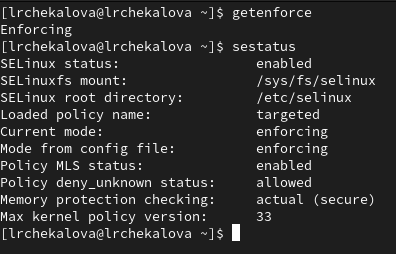{width=70%}

## Запуск веб-сервера

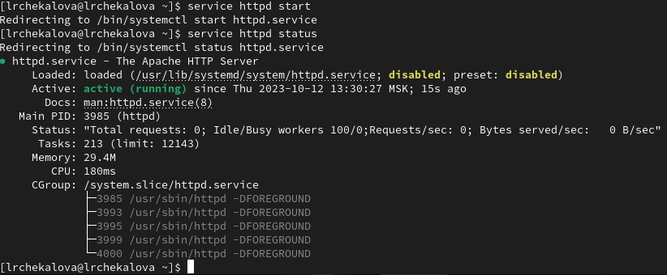

## Просмотр контекста процесса веб-сервера

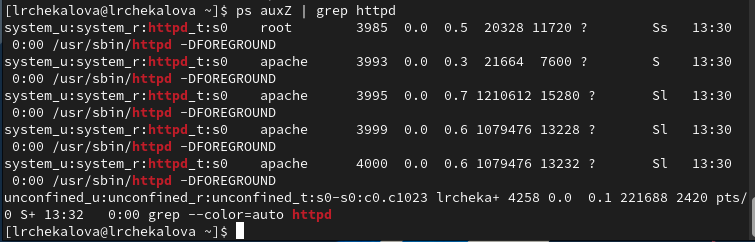{width=70%}

## Просмотр статистики по политике

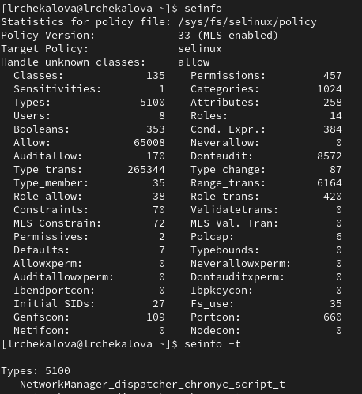{width=70%}

## Просмотр контекстов папок и создание Html-файла

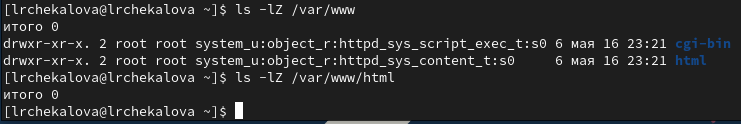{width=70%}

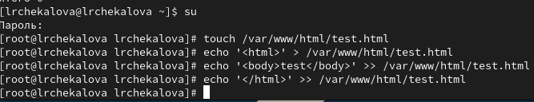{width=70%}

## Отображение файла в браузере

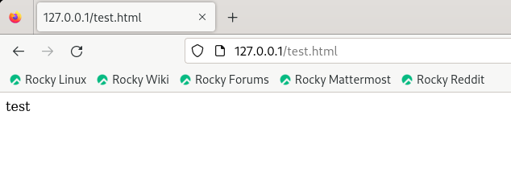{width=70%}

## Изменение контекста и просмотр файла в браузере

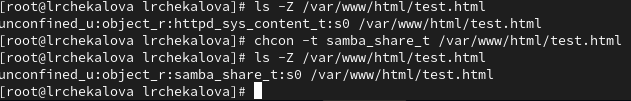{width=70%}

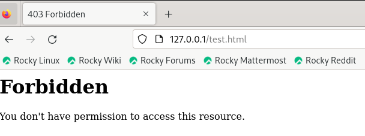{width=70%}

## Просмотр лог-файлов

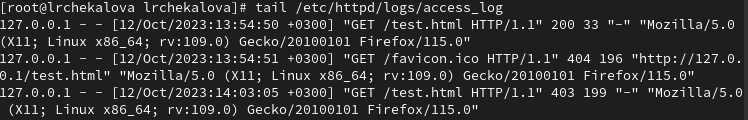{width=70%}

## Изменение порта и перезапуск сервера

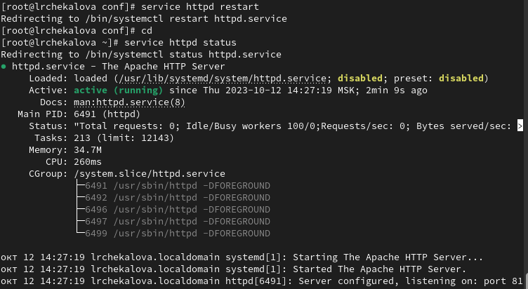{width=70%}

## Просмотр списка портов

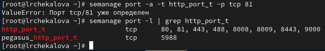{width=70%}

## Возвращение контекста и просмотр в браузере

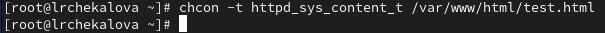{width=70%}

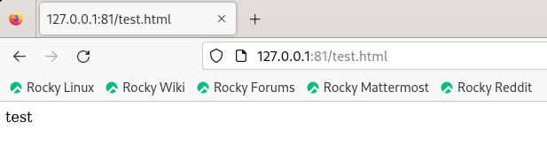{width=70%}

## Удаление порта и файла

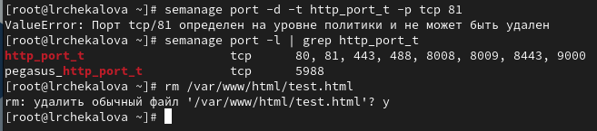{width=70%}

# Результаты

## Результаты работы

- Получены базовые навыки администрирования в Linux
- Рассмотрены принципы работы SELinux
- Изучены принципы работы веб-сервера Apache