---
## Front matter
title: "Отчет по лабораторной работе №6"
subtitle: "Информационная безопасность"
author: "Чекалова Лилия Руслановна"

## Generic otions
lang: ru-RU
toc-title: "Содержание"

## Bibliography
bibliography: bib/cite.bib
csl: pandoc/csl/gost-r-7-0-5-2008-numeric.csl

## Pdf output format
toc: true # Table of contents
toc-depth: 2
lof: true # List of figures
lot: true # List of tables
fontsize: 12pt
linestretch: 1.5
papersize: a4
documentclass: scrreprt
## I18n polyglossia
polyglossia-lang:
  name: russian
  options:
	- spelling=modern
	- babelshorthands=true
polyglossia-otherlangs:
  name: english
## I18n babel
babel-lang: russian
babel-otherlangs: english
## Fonts
mainfont: Times New Roman
romanfont: Times New Roman
sansfont: DejaVu Sans
monofont: DejaVu Sans Mono
mainfontoptions: Ligatures=TeX
romanfontoptions: Ligatures=TeX
sansfontoptions: Ligatures=TeX,Scale=MatchLowercase
monofontoptions: Scale=MatchLowercase,Scale=0.9
## Biblatex
biblatex: true
biblio-style: "gost-numeric"
biblatexoptions:
  - parentracker=true
  - backend=biber
  - hyperref=auto
  - language=auto
  - autolang=other*
  - citestyle=gost-numeric
## Pandoc-crossref LaTeX customization
figureTitle: "Рис."
tableTitle: "Таблица"
listingTitle: "Листинг"
lofTitle: "Список иллюстраций"
lotTitle: "Список таблиц"
lolTitle: "Листинги"
## Misc options
indent: true
header-includes:
  - \usepackage{indentfirst}
  - \usepackage{float} # keep figures where there are in the text
  - \floatplacement{figure}{H} # keep figures where there are in the text
---

# Цель работы

- Развить навыки администрирования ОС Linux
- Получить первое практическое знакомство с технологией SELinux
- Проверить работу SELinx на практике совместно с веб-сервером Apache.

# Задание

- Поиск информации про веб-сервер
- Работа с Html-файлами
- Просмотр лог-файлов

# Теоретическое введение

SELinux представляет собой систему маркировки, каждый процесс файл, каталог, пользователь, устройство, порт и так далее имеет метку. SELinux определяет правила доступа процесса к объектам с определенными метками. Это называется политикой.

Владелец файла не имеет полной свободы действий над атрибутами безопасности. Стандартные атрибуты контроля доступа, такие как группа и владелец ничего не значат для SELinux. Полностью все управляется метками. Значения атрибутов могут быть установлены и без прав root, но на это нужно иметь специальные полномочия SELinux.

SELinux может работать в трех режимах --- отключен, система полностью отключена и не работает, режим ограничений  Enforcing --- программа активирована и блокирует все не соответствующие политикам действия и третий режим Permissive --- только фиксировать нарушения.

Политики SELinux бывают тоже нескольких типов. Политика targeted относится к типу Type Enforcment (TE) политик, в которых управление доступом к файлам осуществляется на основе ролей. Сюда же относится политика strict. Есть ещё политики Multi-Level Security (MLS), в которых добавлены дополнительные категории.

Более подробно о см. в [@lab-theory;@losst].

# Выполнение лабораторной работы

В качестве первого шага лабораторной работы мы проверили режим работы SELinux с помощью команд getenforce и sestatus (рис. @fig:001).

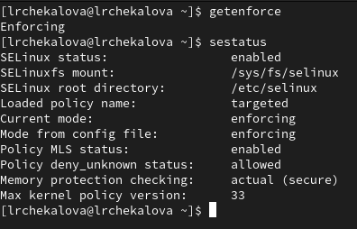{#fig:001 width=70%}

Далее мы проверили, работает ли веб-сервер (рис. @fig:002), и запустили его, так как он не работал (рис. @fig:003).

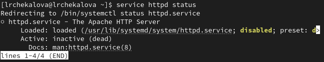{#fig:002 width=70%}

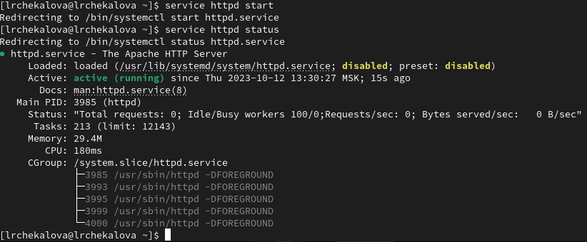{#fig:003 width=70%}

Определили контекст безопасности процесса веб-сервера (рис. @fig:004). Главной информацией для нас стал тип процесса --- httpd_t.

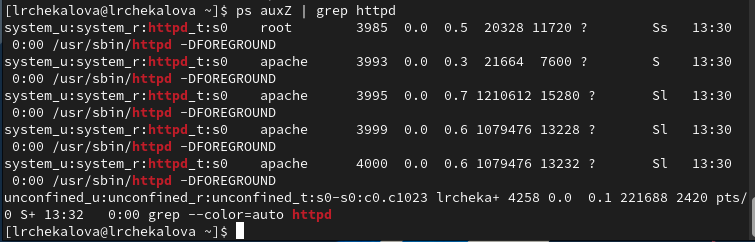{#fig:004 width=70%}

Посмотрели текущее положение переключателей SELinux, большинство из них находятся в выключенном состоянии (рис. @fig:005).

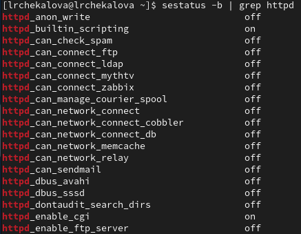{#fig:005 width=70%}

Посмотрели статистику по политике с помощью seinfo (рис. @fig:006). Определили, что множество пользователей имеет размер 8, множество ролей --- 14, а множество типов --- 5100.

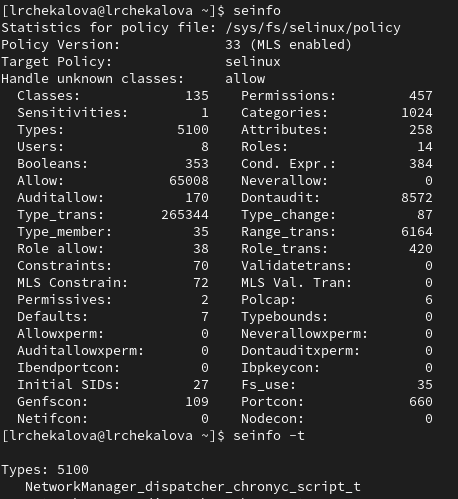{#fig:006 width=70%}

Определили тип файлов и поддиректорий директории /var/www (рис. @fig:007). Поддиректория cgi-bin имеет тип httpd_sys_script_exec_t, а html --- httpd_sys_content_t. Только пользователь-владелец имеет право создавать файлы в папке html.

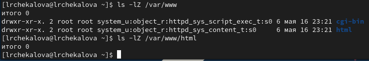{#fig:007 width=70%}

Создали файл test.html в папке html от лица суперпользователя (рис. @fig:008).

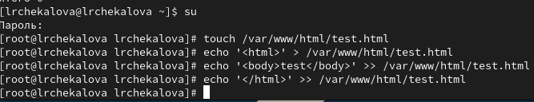{#fig:008 width=70%}

Проверили его контекст (рис. @fig:009). Вновь созданным файлам в папке html по умолчанию присваивается тип httpd_sys_content_t.

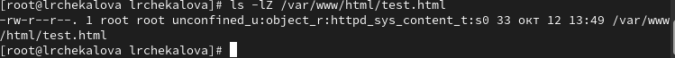{#fig:009 width=70%}

Обратились к файлу через веб-сервер и увидели его содержимое (рис. @fig:010).

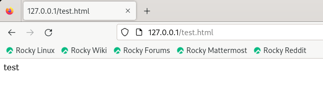{#fig:010 width=70%}

Снова проверили контекст файла и поменяли его на другой (рис. @fig:011). Новый контекст файла не позволяет процессу httpd получить доступ к файлу при обращении к нему через браузер.

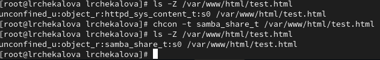{#fig:011 width=70%}

Попробовали открыть файл в браузере (рис. @fig:012). Возникла ошибка из-за нового контекста.

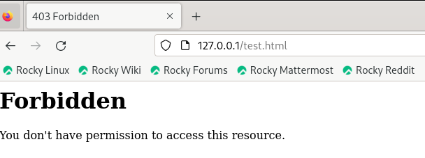{#fig:012 width=70%}

Посмотрели лог-файлы (рис. @fig:013). Увидели запись о неудачной попытке браузера получить доступ к файлу (ошибка 403).

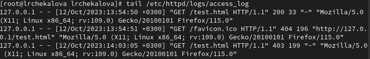{#fig:013 width=70%}

Изменили порт в конфигурационном файле httpd.conf с 80 на 81 (рис. @fig:014).

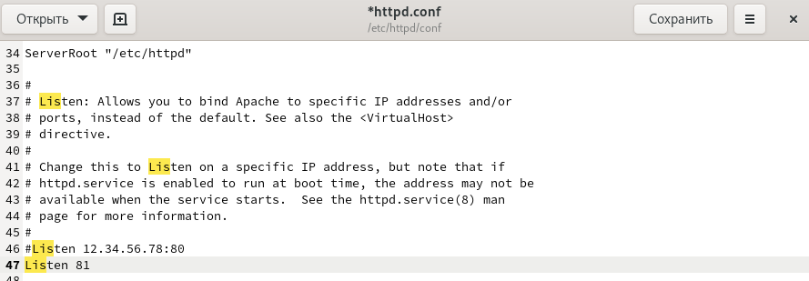{#fig:014 width=70%}

Перезапустили веб-сервер, получили сообщение о том, что он запущен на прослушивание 81 порта (рис. @fig:015).

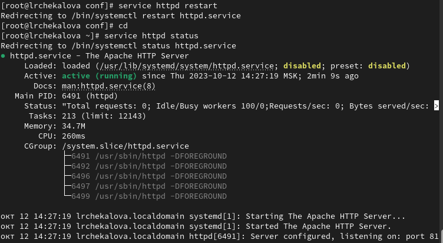{#fig:015 width=70%}

Проверили лог-файлы и нашли информацию о переключении веб-сервера на прослушивание нового порта (рис. @fig:016).

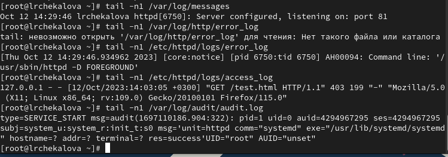{#fig:016 width=70%}

Посмотрели список портов веб-сервера, нашли там указанный нами порт (рис. @fig:017).

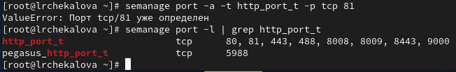{#fig:017 width=70%}

Вернули файлу test.html старый контекст (рис. @fig:018).

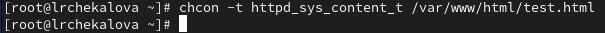{#fig:018 width=70%}

Получили доступ к файлу через веб-сервер в браузере (рис. @fig:019).

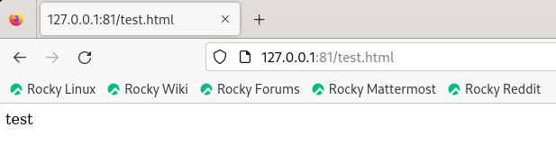{#fig:019 width=70%}

Вернули порт 80 в конфигурационном файле (рис. @fig:020).

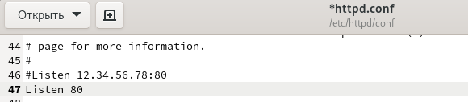{#fig:020 width=70%}

Попытались удалить 81 порт, но столкнулись с ошибкой, что он определен на уровне политики и не может быть удален (рис. @fig:021). После этого удалили файл test.html.

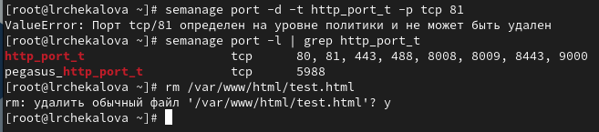{#fig:021 width=70%}

# Выводы

В результате лабораторной работы я получила базовые навыки администрирования ОС Linux, познакомилась с технологией SELinux и проверила ее работу на практике совместно с веб-сервером Apache.

# Список литературы{.unnumbered}

::: {#refs}
:::