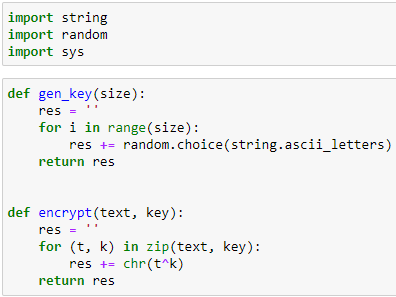
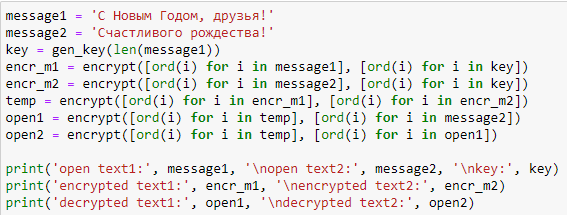
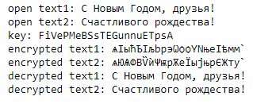

---
## Front matter
title: "Отчет по лабораторной работе №8"
subtitle: "Информационная безопасность"
author: "Чекалова Лилия Руслановна"

## Generic otions
lang: ru-RU
toc-title: "Содержание"

## Bibliography
bibliography: bib/cite.bib
csl: pandoc/csl/gost-r-7-0-5-2008-numeric.csl

## Pdf output format
toc: true # Table of contents
toc-depth: 2
lof: true # List of figures
lot: true # List of tables
fontsize: 12pt
linestretch: 1.5
papersize: a4
documentclass: scrreprt
## I18n polyglossia
polyglossia-lang:
  name: russian
  options:
	- spelling=modern
	- babelshorthands=true
polyglossia-otherlangs:
  name: english
## I18n babel
babel-lang: russian
babel-otherlangs: english
## Fonts
mainfont: Times New Roman
romanfont: Times New Roman
sansfont: DejaVu Sans
monofont: DejaVu Sans Mono
mainfontoptions: Ligatures=TeX
romanfontoptions: Ligatures=TeX
sansfontoptions: Ligatures=TeX,Scale=MatchLowercase
monofontoptions: Scale=MatchLowercase,Scale=0.9
## Biblatex
biblatex: true
biblio-style: "gost-numeric"
biblatexoptions:
  - parentracker=true
  - backend=biber
  - hyperref=auto
  - language=auto
  - autolang=other*
  - citestyle=gost-numeric
## Pandoc-crossref LaTeX customization
figureTitle: "Рис."
tableTitle: "Таблица"
listingTitle: "Листинг"
lofTitle: "Список иллюстраций"
lotTitle: "Список таблиц"
lolTitle: "Листинги"
## Misc options
indent: true
header-includes:
  - \usepackage{indentfirst}
  - \usepackage{float} # keep figures where there are in the text
  - \floatplacement{figure}{H} # keep figures where there are in the text
---

# Цель работы

- Освоить на практике применение режима однократного гаммирования на примере кодирования различных исходных текстов одним ключом.

# Задание

- Написание программы
- Зашифровка текстов по открытым текстам и известному ключу
- Расшифровка текстов без использования ключа

# Теоретическое введение

Гаммирование представляет собой наложение (снятие) на открытые (зашифрованные) данные последовательности элементов других данных, полученной с помощью некоторого криптографического алгоритма, для получения зашифрованных (открытых) данных. Иными словами, наложение гаммы — это сложение её элементов с элементами открытого (закрытого) текста по некоторому фиксированному модулю, значение которого представляет собой известную часть алгоритма шифрования.

Наложение гаммы представляет собой выполнение операции сложения по модулю 2 (XOR) между элементами гаммы и элементами подлежащего сокрытию текста.

Более подробно о см. в [@lab-theory].

# Выполнение лабораторной работы

Для выполнения лабораторной работы я написала программу для зашифрования и расшифровки текста. Импортировав необходимые библиотеки, я задала две функции --- для генерации ключа по размеру сообщения (выбор случайных букв в кодировке ASCII) и для шифрования (поэлементный XOR) (рис. @fig:001).

{#fig:001 width=70%}

Далее я задала два открытых сообщения одинаковой длины, сгенерировала ключ и закодировала сообщения с помощью этого ключа. После этого я ввела промежуточную переменную temp, в которой сохранила результат поэлементного XOR между двумя зашифрованными сообщениями. Чтобы расшифровать первый текст, я произвела поэлементный XOR temp и второго открытого сообщения, а для расшифровки второго сообщения --- поэлементный XOR temp и первого сообщения (рис. @fig:002).

{#fig:002 width=70%}

Полученные сообщения я вывела на экран (рис. @fig:003). Сообщения были успешно закодированы с помощью заданного ключа и раскодированы без использования этого ключа.

{#fig:003 width=70%}

# Выводы

В результате лабораторной работы я закрепила знания о базовых элементах криптографии и освоила на примере шифрования двух текстов одним ключом применение режима однократного гаммирования, написав программу, позволяющую зашифровывать тексты и расшифровывать их, даже не зная ключа.

# Список литературы{.unnumbered}

::: {#refs}
:::